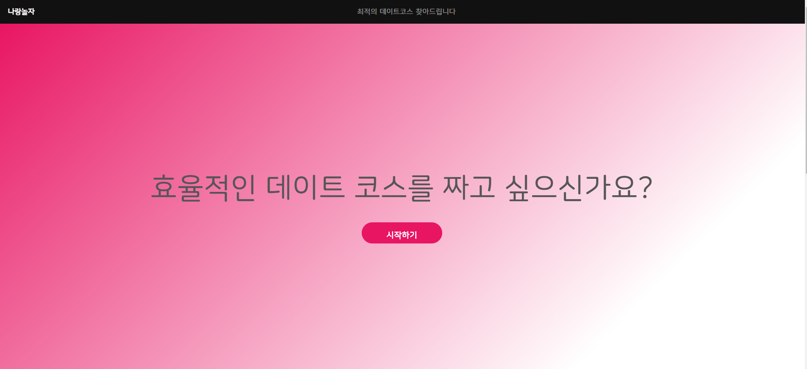
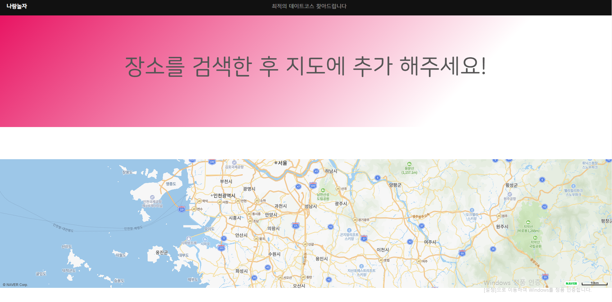

#  데이트 코스 추천 서비스

- 군 생활 중 진행하는 토이 프로젝트.   
- 뚜벅이들을 위해 경로와 **이동시간을 고려**하여 최적의 코스를 찾아주는 서비스!  
- [여기](http://15.164.88.155/) 로 들어가면 된다.   

> 간단한 토이 프로젝트이므로, 서버 성능도 안 좋고 도메인도 따지 못했다.  

## 개발과정 미디엄 정리

1. [웹 서버 구축하기](https://medium.com/myinterest/20%EB%85%84-%EC%B6%94%EC%84%9D%EC%9D%84-%EB%A7%9E%EC%9D%B4%ED%95%98%EB%8A%94-%ED%86%A0%EC%9D%B4-%ED%94%84%EB%A1%9C%EC%A0%9D%ED%8A%B8-1-%EC%9B%B9-%EC%84%9C%EB%B2%84-%EA%B5%AC%EC%B6%95%ED%95%98%EA%B8%B0-416c2960318f?source=friends_link&sk=1b051d7dad858e48c10e493c110d31f9)   
2. [지도 API 가져오기](https://medium.com/myinterest/%EA%B5%B0%EB%8C%80%EC%97%90%EC%84%9C-%ED%86%A0%EC%9D%B4%ED%94%84%EB%A1%9C%EC%A0%9D%ED%8A%B8-2-%EC%A7%80%EB%8F%84-api-%EA%B0%80%EC%A0%B8%EC%98%A4%EA%B8%B0-c4b4e929dfec)  
@Merry christmas@
## 진행 과정 

### 메인 페이지

### 지도 경로 페이지

# 개발자 정보
- 김경민 ([LinkedIn](https://www.linkedin.com/in/kyungmin-kim/),  [Medium](https://medium.com/@lufovic77))
- 성균관대학교 소프트웨어학과 3학년 수료 후 군 휴학 (~21.06.03)
